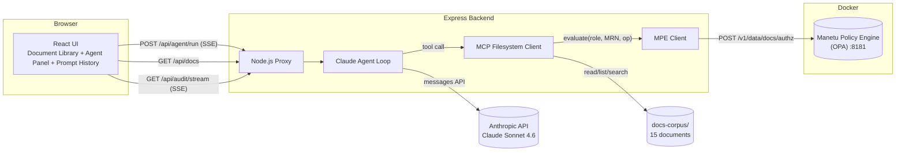

# AI Document Hub

A React/TypeScript dashboard that demonstrates **AI agent orchestration** via the [Model Context Protocol (MCP)](https://modelcontextprotocol.io/), secured by the [Manetu Policy Engine (MPE)](https://manetu.github.io/policyengine). Every AI tool call is gated by fine-grained, role-based access control — and every policy decision is visible in a real-time audit trail.

> **Built with Claude** — this project was developed using [Claude Code](https://claude.ai/code) (Anthropic's AI coding agent) for implementation, architecture decisions, and iterative UI refinement.

## Why This Project Matters

This project makes AI agent security **visible and interactive**. You can watch every tool call get checked by the Manetu Policy Engine (MPE) in real time, switch roles to see access change instantly, and toggle security off to see exactly what the MPE policy layer prevents.

- **Watch** an AI agent (Claude Sonnet 4.6) answer questions by reading documents across sensitivity tiers
- **See** every tool invocation evaluated **before** execution — with allow/deny decisions in real time
- **Switch roles** instantly — a viewer can only read public docs, while an admin has full access
- **Browse prompt history** — every thinking step, tool call, MRN, policy rule, and final answer is recorded
- **Toggle security off** to compare — demonstrating exactly what the policy engine blocks

### The Problem

Traditional access control (RBAC, ACLs) was designed for humans navigating predefined workflows. AI agents break that model: they chain tool calls autonomously, access resources the user never explicitly requested, and can escalate through indirect paths.

Asking to "summarize all documents" triggers reads across every sensitivity tier — a role that's safe for a human clicking one file at a time becomes dangerously broad when an agent iterates the entire corpus in seconds.

### The Solution

The [Manetu Policy Engine](https://manetu.github.io/policyengine) evaluates access at the **tool call level** using MRN-based policies (Manetu Resource Notation). Instead of blanket "this user can access this service," it answers: _"Can a viewer-role agent invoke `read-file` on a confidential document right now?"_ — and produces a structured audit record for every decision.

## Architecture



## Roles and Access

### Document Access by Sensitivity Tier

| Role | Public | Internal | Confidential |
|------|:------:|:--------:|:------------:|
| Viewer | Read | Denied | Denied |
| Developer | Read | Read | Denied |
| Data Analyst | Read | Read | Denied |
| Auditor | Read | Read | Read (read-only) |
| Admin | Full | Full | Full |

### Tool Permissions

| Role | list-directory | read-file | keyword-search |
|------|:--------------:|:---------:|:--------------:|
| Viewer | Yes | No | No |
| Developer | Yes | Yes | Yes |
| Data Analyst | Yes | Yes | Yes |
| Auditor | Yes | Yes | No |
| Admin | Yes | Yes | Yes |

Tool access is enforced at the MRN level. Even if a role has `read-file` permission, the document's sensitivity tier is checked separately — a developer with `read-file` access will still be denied when attempting to read a confidential document.

## Quick Start

### Prerequisites

- Node.js 20+
- Docker Desktop (for OPA policy engine)
- Anthropic API key ([console.anthropic.com](https://console.anthropic.com/settings/keys))

### Install and Run

```bash
git clone <repo-url>
cd manetu-document-hub
npm install

# 1. Start the policy engine
docker compose -f docker/docker-compose.yml up -d

# 2. Set up environment
cp .env.example .env
# Edit .env and add your ANTHROPIC_API_KEY

# 3. Run the app
npm run dev:all          # Vite on :5173 + Express on :3001
```

The app will be at **http://localhost:5173**.

### Running Without Docker

The app works without Docker — the backend will return a clear error if OPA is unreachable when security is enabled. You can disable the policy engine via the toggle in the header to use the agent without OPA.

### Environment Variables

| Variable            | Description                                              |
| ------------------- | -------------------------------------------------------- |
| `ANTHROPIC_API_KEY` | Claude API key (required for agent)                      |
| `MPE_BASE_URL`      | OPA policy engine URL (default: `http://localhost:8181`) |
| `MCP_DOCS_PATH`     | Path to document corpus (default: `./docs-corpus`)       |
| `PORT`              | Backend server port (default: `3001`)                    |

## UI Overview

### Three-Panel Layout

- **Left — Document Library**: Browse 15 documents organized by sensitivity tier (public/internal/confidential). Documents show sensitivity badges and lock icons based on the active role. Click to preview in a modal with full markdown rendering.

- **Center — Agent Task View**: Chat interface powered by Claude Sonnet 4.6. Type a question or click a suggested prompt. The agent reads documents, respects policy checks, and streams responses. Shows task status (running/completed/failed) with stop and new task controls.

- **Right — Prompt History & Agent Steps**: Master-detail view. The list shows all past prompt runs with role, timestamp, and allow/deny counts. Click any run to see the full step trace: thinking cards, tool call cards with MRN and policy decision badges, and the final markdown answer with source citations.

### Header Controls

- **Brand bar** — purple Manetu AI Document Hub branding
- **Controls row** — Role switcher (5 roles with color-coded dots), Manetu Policy Engine toggle (enabled/disabled with confirmation dialog), and dark/light theme toggle

### Security Demo Mode

Toggle the policy engine off to see the difference:

- **Enabled**: Every tool call is checked against OPA. Denied calls show the policy rule that blocked them.
- **Disabled**: All tool calls bypass security. A red warning banner appears. Audit events show "BYPASSED" instead of "ALLOWED"/"DENIED".

## Document Corpus

15 realistic fake company documents in `docs-corpus/`:

| Tier             | Count | Examples                                                                             |
| ---------------- | ----- | ------------------------------------------------------------------------------------ |
| **Public**       | 5     | Company overview, product announcement, engineering blog, security FAQ, job postings |
| **Internal**     | 5     | Team wiki, 2026 roadmap, incident postmortem, hiring pipeline, AI strategy draft     |
| **Confidential** | 5     | Q3 financials, board update, M&A analysis, compensation bands, security audit        |

Each document has YAML frontmatter with `title`, `sensitivity`, `category`, `author`, `date`, and `excerpt`.

## Testing

```bash
# Unit tests (Vitest + React Testing Library)
npm test                 # watch mode
npm run test:coverage    # single run with coverage

# E2E tests (Cypress)
npm run build && npm run preview   # start the preview server first
npm run cypress:open                # interactive mode
npm run cypress:run                 # headless (CI)
```

## Project Structure

```
src/
  components/
    dashboard/       App shell, header, panels, role switcher, security toggle
    agent/           Agent task panel, step trace cards, prompt history
    audit/           Audit event rows, audit log panel
    docs/            Document library, doc cards, sensitivity badges, preview modal
  hooks/
    useAgentRun.ts   SSE stream parser for agent runs
    useAuditStream.ts  EventSource connection to audit SSE endpoint
    useDocLibrary.ts   Fetches docs with role-based access flags
    useDocContent.ts   Fetches document content for preview
  lib/
    api.ts           Typed fetch wrapper (auto-attaches x-role, x-security-enabled)
    store.ts         Zustand store with localStorage persistence
    theme.ts         MUI theme (dark/light mode, purple brand palette)
  types/
    index.ts         All domain types (single source of truth)
  pages/
    Dashboard.tsx    Main page layout
server/
  index.ts           Express entry point
  routes/
    agent.ts         POST /api/agent/run — SSE streaming agent orchestration
    tools.ts         GET /api/tools — MPE-filtered tool list with 60s cache
    docs.ts          GET /api/docs — doc list; GET /api/docs/content/:path — doc content
    audit.ts         GET /api/audit/stream — persistent SSE audit broadcast
  middleware/
    roleExtract.ts   x-role header validation
  lib/
    claude-agent.ts  Agent loop: Claude API → MPE check → tool execution → SSE emit
    mpe-client.ts    Typed OPA client (evaluate + discover)
    mcp-fs-client.ts Filesystem client (list, read, keyword search with frontmatter)
    audit-bus.ts     Event bus with 50-event ring buffer
    tool-registry.ts 6 MCP tool definitions with MRNs
docker/
  docker-compose.yml     OPA policy engine on port 8181
  docker-compose.ci.yml  CI override
policies/
  docs-domain.rego   OPA Rego policy (default-deny, MRN wildcard matching)
  roles-data.json    Role grants for all 5 roles
cypress/
  e2e/               E2E test specs
  fixtures/          Mock API responses (12 fixture files)
  support/           Custom commands (switchRole, toggleSecurity, etc.)
docs-corpus/
  public/            5 public documents
  internal/          5 internal documents
  confidential/      5 confidential documents
```

## CI/CD

GitHub Actions pipeline (`.github/workflows/ci.yml`) runs on every push to `main` and all PRs:

1. **Lint** — `eslint --max-warnings 0`
2. **Typecheck** — `tsc --noEmit` (frontend + server)
3. **Unit tests** — `vitest run --coverage`
4. **Build** — `vite build`
5. **Cypress E2E** — headless Chrome against `vite preview`

No API keys or Docker required in CI — Cypress tests use `cy.intercept()` to mock all backend calls.

## Tech Stack

| Layer            | Technology                                                       |
| ---------------- | ---------------------------------------------------------------- |
| Frontend         | React 19, TypeScript, MUI v7, Zustand (persisted), Framer Motion |
| Backend          | Express 5, Node.js 20                                            |
| AI               | Claude Sonnet 4.6 (Anthropic SDK)                                |
| Policy Engine    | OPA (Open Policy Agent) with Rego policies                       |
| Document Parsing | gray-matter (YAML frontmatter)                                   |
| Markdown         | react-markdown + remark-gfm                                      |
| Testing          | Vitest, React Testing Library, MSW, Cypress                      |
| Build            | Vite 7                                                           |
| CI               | GitHub Actions                                                   |
